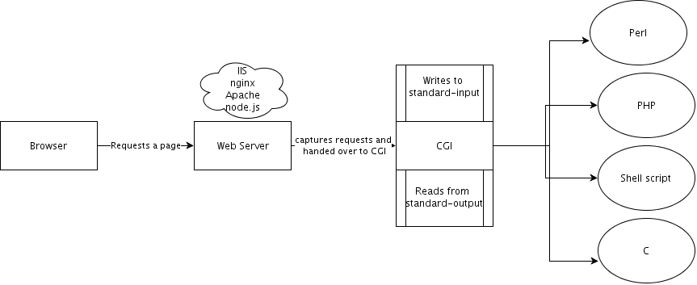
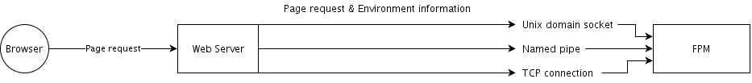
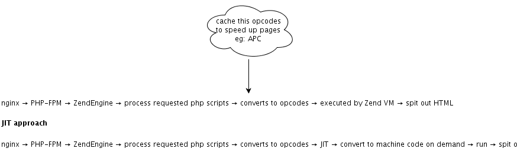

   * [Introduction](README.md#introduction)
   * [History](README.md#history)
      * [What is CGI](README.md#what-is-cgi)
   * [FastCGI ](README.md#fastcgi)
            * [Unix domain socket](README.md#unix-domain-socket)
            * [Named pipe](README.md#named-pipe)
            * [TCP connection](README.md#tcp-connection)
   * [Zend Engine](README.md#zend-engine)


# Introduction

-   Today we are able to develop interoperable PHP components which can
    be plugged and shared between any frameworks through component
    dependency manager like **composer**.
-   This is possible because today developers adheres to **PSR** (PHP
    Standard Recommendations) - the PHP standards as stipulated by PHP
    FIG (Framework Interop Group).
-   We test our codes thoroughly using **PHPUnit.**
-   We deploy our applications with **PHP FPM** (FastCGI Process
    Manager) behind a web server like **nginx.**
-   We increase application performance through **opcode cache.**

# History

## What is CGI

CGI - Common Gateway Interface is an old protocol which acts as a common
interface for Web Server to operate with CGI programs.

 <br/>

CGI protocol mandates a uniform way for reading data from browsers and
passing them as environment variables to the program - into the
**standard input**. So, even a C program or shell script could read
browser inputs by reading from standard input. The CGI script - that
program in any language should now write into **standard output**, which
will be read by CGI to pass as response to the browser. Typically all
those scripts were placed in a single directory like **cgi-bin**. The main
disadvantage with this approach is that each new request would create a new process in the OS - that causes very heavy
overhead for multiple requests. This **"one new process per request"** model
makes CGI programs very inefficient. Also, **time taken to create a new
process was higher than time taken for output generation**. Thus, modern
systems as we see today has evolved for all languages.

-   For perl, **Apache** adds an embedded interpreter module named
    **mod\_perl**
-   For php, **Apache** adds an embedded interpreter module named
    **mod\_php**
-   **FastCGI** is an evolved form of older **CGI **
    -   **FastCGI** implementation for PHP released as **PHP-FPM**

# FastCGI 

FastCGI is a revamp on CGI.

| CGI                                                             | FastCGI                                             |
|-----------------------------------------------------------------|-----------------------------------------------------|
| One new process per request                                     | One process reused across multiple requests         |
| A process is created on a request and killed on giving response | Persistent process handles requests one after other |

 
 <br/>

#### Unix domain socket

-   These are sockets within a system that allows communication between
    processes through kernel
-   Used for Interprocess communication - two processes within the same
    host can communicate each other
-   A socket is essentially a file in the linux file system. <br/> For eg: `/tmp/someapp.sock` is a unix domain socket
-   The permissions on this socket is dictated by the permission of
    filesystem
-   `ls -l` command would indicate the type of this file using `'s'`
-   The nginx configuration for connecting to PHP-FPM via socket is: <br/>
    ```nginx fastcgi\_pass unix:/var/run/php5-fpm.sock;```

#### Named pipe

Pipe in unix is a file which can be used for interprocess communication
as one process could write into it, where another process could read
from it.

`$ ps aux | grep conky | grep -v grep | awk '{print $2}' | xargs kill`

Named Pipe is a more advanced in that you could create a pipe and name
it using `mkfifo` command, and the other process can conveniently read
from it. 

|Command|Explanation|
|-------|------------|
|`mkfifo -m 0666 /tmp/namedPipe`|Create a named pipe|
|`gzip -d < file.gz > /tmp/namedPipe`| Unzip a file into the named pipe|
|`LOAD DATA INFILE '/tmp/namedPipe' INTO TABLE tableName;`|Load the unzipped file into mysql|

By the above example it avoids the need for at first deflating file into
somewhere, and load that file into mysql. Instead we have used a named
pipe to do the piping between zipped file and mysql.

#### TCP connection

In cases where you need TCP connection to establish a 

fastcgi\_pass 127.0.0.1:9000;

# Zend Engine

Zend Engine is the core of the PHP. When a website is opened in browser,
the typical workflow is :

 <br/>

Zend Engine comes as a part of the Apache mod\_php, PHP-FPM or other
flavours. Speed of web request roundtrips can be optimised a dozen times
by caching this opcodes. You may use APC. 

#### JIT (By PHP 8)

Usually Zend Engine would convert a PHP script into opcodes and execute
opcodes to churn out HTML.

Here, each time when a web page is loaded, the same process repeats. To
save this time and resources, JIT compiler could convert this opcode
into machine code and keep in memory. Next time when the same PHP script
is requested, the machine code is directly run thus saving time.
